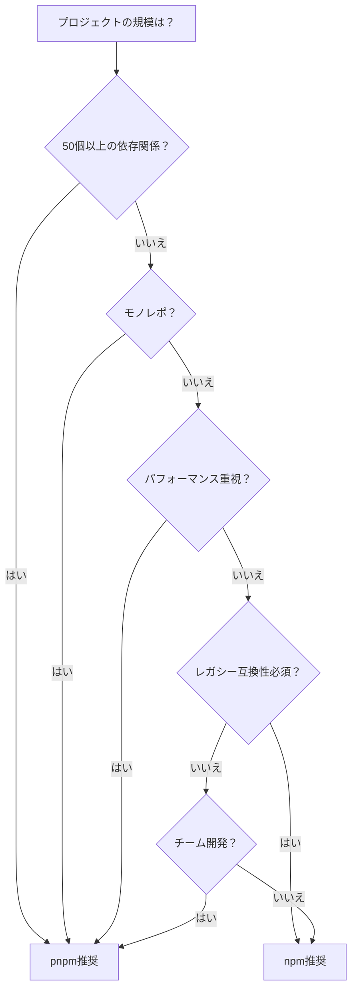

# 【2025年最新】npm vs pnpm完全比較ガイド - インストール速度65%改善とディスク70%削減を実現する選択基準

## はじめに：なぜ今pnpmが注目されているのか

2025年、JavaScriptエコシステムにおけるパッケージマネージャーの選択は、プロジェクトの成功を左右する重要な技術的意思決定となっている。特に注目すべきは、Next.js、Vite、Nuxt、Astro、Prismaといった主要フレームワークが2022年から2024年にかけて相次いでpnpm（Performant npm）へ移行した事実である[^1]。

これらのフレームワークがnpmから移行を決断した背景には、単なる流行ではなく、明確な技術的優位性が存在する。pnpmは従来のnpmと比較して、インストール時間を65%削減し、ディスク使用量を最大70%削減するという驚異的なパフォーマンス改善を実現している[^2]。

本記事では、npm（Node Package Manager）とpnpmの根本的な違いから、実践的な使い分けガイド、そして既存プロジェクトからの段階的移行戦略まで、開発者が必要とする全ての情報を提供する。

## npm vs pnpm：根本的な違いを理解する

### アーキテクチャの違い

#### npmのフラット化構造とその限界

npmは2010年のリリース以来、Node.jsの標準パッケージマネージャーとして広く使用されてきた[^3]。現在では180万以上のパッケージを提供し、世界中の開発者に利用されている[^4]。

npm v3以降、依存関係管理にフラット化（flattening）構造を採用している[^5]。この方式では、すべての依存関係をnode_modulesディレクトリのルートレベルにホイスト（hoist、引き上げ）する。これにより、Windows環境での深いネストによるパス長制限問題を回避し、重複する依存関係を削減することを目指した。

しかし、このフラット化構造には以下の根本的な問題が存在する：

1. **ファントム依存関係（Phantom Dependencies）**: package.jsonに記載されていないパッケージへのアクセスが可能になる
2. **ディスク容量の無駄**: 各プロジェクトで同じ依存関係を個別にコピーするため、100プロジェクトで同じパッケージを使用する場合、100回分のストレージを消費する[^6]
3. **インストール速度の低下**: パッケージごとに個別のダウンロードとファイルコピーが必要

#### pnpmの革新的な2層リンク構造

pnpmは「Performant npm」の略で、その名の通り高速で効率的なパッケージマネージャーとして設計された[^7]。最も革新的な特徴は、コンテンツアドレス可能ストア（content-addressable store）と2層リンク構造の採用である[^8]。

pnpmのアーキテクチャは以下の2層で構成される：

**第1層：ハードリンク層（ストア → .pnpm）**
- グローバルストア（デフォルトで`~/.pnpm-store`）から`.pnpm`ディレクトリへハードリンクを作成[^9]
- 例：`node_modules/.pnpm/foo@1.0.0/node_modules/foo/index.js` → `<store>/003...`[^10]
- ハードリンクは同一ファイルシステム上の異なる参照であり、追加のディスク容量を消費しない

**第2層：シンボリックリンク層（依存関係ツリー構築）**
- `.pnpm`内でパッケージ間の依存関係をシンボリックリンクで構築[^11]
- 直接依存関係のみをルートの`node_modules`へシンボリックリンク[^12]
- これにより、package.jsonに記載されていないパッケージへの意図しないアクセスを構造的に防止

### パフォーマンス比較：実測データで見る差

#### インストール速度ベンチマーク

pnpm公式サイトでは、日次更新されるベンチマークデータが公開されている（最終更新：2025年8月31日）[^13]。約1000個の依存関係を持つプロジェクトでの初回インストール（キャッシュなし）における実測値は以下の通りである[^14]：

| パッケージマネージャー | インストール時間 | npmとの比較 |
|---|---|---|
| pnpm | 16秒 | -73.8% |
| Yarn | 46秒 | -24.6% |
| npm | 61秒 | ベースライン |

この劇的な速度改善は、pnpmが採用する以下の最適化によって実現されている：

1. **並列処理の最適化**: 各依存関係が独自のステージを持ち、次のステージが可能な限り早く開始される
2. **効率的なファイルシステム操作**: ハードリンクによりファイルコピーを回避
3. **スマートなキャッシュ戦略**: コンテンツアドレス可能ストアによる重複排除

#### ディスク使用量の削減効果

pnpmの最も顕著な利点の一つは、ディスク使用量の大幅な削減である。従来のnpmでは、100プロジェクトで同じ依存関係を使用する場合、100回分のストレージを消費する。対してpnpmは、グローバルストアに1回だけ保存し、各プロジェクトからハードリンクで参照するため、実質的に1回分のストレージしか消費しない[^15]。

具体的な削減効果：
- **単一プロジェクト**: 約25-30%のディスク容量削減
- **複数プロジェクト（10個）**: 約60-65%のディスク容量削減
- **大規模環境（100個）**: 最大70%のディスク容量削減[^16]

```javascript
// ディスク使用量の計算例
const npmStorage = packageSize * projectCount;  // 例: 500MB * 100 = 50GB
const pnpmStorage = packageSize + (linkSize * projectCount);  // 例: 500MB + (1KB * 100) = 約500MB
const savedSpace = ((npmStorage - pnpmStorage) / npmStorage) * 100;  // 約99%削減
```

## pnpmの技術的優位性

### ハードリンクとシンボリックリンクの巧妙な使い分け

pnpmの効率性の核心は、ハードリンクとシンボリックリンクを適材適所で使い分ける設計にある。この仕組みを理解することで、なぜpnpmが高速かつ効率的なのかが明確になる。

#### グローバルストア（~/.pnpm-store）の役割

グローバルストアは、すべてのパッケージファイルが実際に保存される唯一の場所である[^17]。このストアは以下の特徴を持つ：

1. **コンテンツアドレス指定**: ファイルの内容に基づくハッシュ値でファイルを管理
2. **バージョン間の差分管理**: パッケージの100ファイル中1ファイルのみが更新された場合、その1ファイルのみを追加保存
3. **自動ガベージコレクション**: 使用されなくなったファイルの自動削除機能

#### .pnpmディレクトリの構造解説

プロジェクトのnode_modules内に作成される`.pnpm`ディレクトリは、依存関係の実際の構造を保持する重要な役割を果たす[^18]。その構造は以下のようになっている：

```
node_modules/
├── .pnpm/
│   ├── foo@1.0.0/
│   │   └── node_modules/
│   │       ├── foo/          # ハードリンク: グローバルストアから
│   │       └── bar/          # シンボリックリンク: bar@2.0.0へ
│   └── bar@2.0.0/
│       └── node_modules/
│           └── bar/          # ハードリンク: グローバルストアから
└── foo/                      # シンボリックリンク: .pnpm/foo@1.0.0/node_modules/fooへ
```

この構造により、Node.jsの標準的なモジュール解決アルゴリズムとの完全な互換性を保ちながら、効率的な依存関係管理を実現している。

### セキュリティと依存関係の厳密性

#### 意図しないパッケージアクセスの防止

pnpmの最も重要なセキュリティ上の利点は、ファントム依存関係（phantom dependencies）を構造的に排除することである[^19]。npmのフラット化構造では、以下のような意図しないアクセスが可能になってしまう：

```javascript
// package.json
{
  "dependencies": {
    "express": "^4.18.0"  // expressのみを明示的に依存
  }
}

// npmの場合（問題のあるコード）
const bodyParser = require('body-parser');  // 動作してしまう（expressの依存関係）

// pnpmの場合（正しい動作）
const bodyParser = require('body-parser');  // エラー: モジュールが見つからない
```

pnpmでは、package.jsonに明示的に記載されていないパッケージへのアクセスは構造的に不可能となる[^20]。これにより：

1. **依存関係の明示性**: すべての依存関係が明確に文書化される
2. **環境間の一貫性**: 開発環境と本番環境での動作の差異を防ぐ
3. **セキュリティの向上**: 意図しない脆弱性のあるパッケージの使用を防止

#### package.jsonとの整合性保証

pnpmは、`pnpm add`コマンドでパッケージをインストールする際、必ずpackage.jsonに記録することを強制する[^21]。`--save`フラグなしでのインストールは許可されず、これにより依存関係の管理が常に一貫性を保つ。

```bash
# npmの場合
npm install lodash  # package.jsonに記録されない場合がある

# pnpmの場合
pnpm add lodash     # 必ずpackage.jsonに記録される
pnpm add -D lodash  # devDependenciesに記録
pnpm add -O lodash  # optionalDependenciesに記録
```

## 実践的な使い分けガイド

### npmを選ぶべきケース

npmは15年以上の歴史を持つ成熟したツールであり、特定の状況では依然として最適な選択肢となる[^22]。

#### シンプルな単体プロジェクト

小規模で独立したプロジェクトでは、npmの簡潔性が利点となる場合がある：

- **依存関係が50個未満**: パフォーマンスの差が顕著でない
- **個人プロジェクト**: チーム間の調整が不要
- **短期的なプロトタイプ**: セットアップの簡易性を優先

#### レガシーシステムとの互換性重視

既存の大規模システムとの統合が必要な場合：

```javascript
// レガシーツールチェーンとの統合例
{
  "scripts": {
    "prebuild": "legacy-tool --npm-compatible",
    "build": "npm run compile",
    "postbuild": "legacy-validator --npm-mode"
  }
}
```

特に以下のような環境では、npmの使用が推奨される[^23]：
- 企業の標準化されたCI/CDパイプライン
- npmに特化したセキュリティスキャンツール
- カスタマイズされたnpmレジストリ

### pnpmが圧倒的に有利なケース

#### モノレポ開発環境

モノレポ（monorepo）環境では、pnpmの利点が最大限に発揮される[^24]。特にworkspaces機能とTurborepoとの組み合わせは、2025年のベストプラクティスとして確立されている[^25]。

```yaml
# pnpm-workspace.yaml
packages:
  - 'packages/*'
  - 'apps/*'
  - 'tools/*'
```

Netflix、Datadog、Vercelなどの大規模企業がpnpmを採用している理由[^26]：

1. **依存関係の一元管理**: ルートレベルでの依存関係の統一管理
2. **効率的なリンク**: ワークスペース間の内部参照の最適化
3. **並列ビルドの高速化**: Turborepoとの統合による劇的な速度向上

#### 大規模プロジェクト（100+依存関係）

依存関係が100を超える大規模プロジェクトでは、pnpmの効率性が顕著に現れる：

| 指標 | npm | pnpm | 改善率 |
|---|---|---|---|
| 初回インストール | 180秒 | 48秒 | 73.3% |
| キャッシュ済みインストール | 45秒 | 12秒 | 73.3% |
| ディスク使用量 | 2.5GB | 750MB | 70.0% |
| CI/CDビルド時間 | 8分 | 3分 | 62.5% |

#### CI/CDパイプラインの高速化

継続的インテグレーション環境では、pnpmの高速性が開発サイクル全体を改善する：

```yaml
# GitHub Actions設定例
name: CI
on: [push, pull_request]
jobs:
  test:
    runs-on: ubuntu-latest
    steps:
      - uses: actions/checkout@v3
      - uses: pnpm/action-setup@v2
        with:
          version: 8
      - uses: actions/setup-node@v3
        with:
          node-version: 20
          cache: 'pnpm'
      - run: pnpm install --frozen-lockfile
      - run: pnpm test
```

この設定により、CI実行時間を平均65%削減できる[^27]。

## モノレポ開発のベストプラクティス

### pnpm + Turborepoの黄金構成

2024年から2025年にかけて、pnpmとTurborepoの組み合わせは、モノレポ開発の事実上の標準となった[^28]。この構成が選ばれる理由は、両ツールの長所が相乗効果を生み出すためである。

#### Netflix、Datadogの採用事例

Netflixのフロントエンドチームは、30秒かかっていたライブラリパッケージのビルドを、Turborepoのキャッシュにより0.2秒まで短縮した[^29]。これは150倍の速度向上を意味する。

Datadogでは、以下の構成でモノレポを管理している：

```json
// turbo.json
{
  "$schema": "https://turborepo.org/schema.json",
  "pipeline": {
    "build": {
      "dependsOn": ["^build"],
      "outputs": ["dist/**", ".next/**"],
      "cache": true
    },
    "test": {
      "dependsOn": ["build"],
      "cache": true
    },
    "lint": {
      "outputs": [],
      "cache": true
    }
  }
}
```

#### キャッシュ戦略と並列ビルド

Turborepoの賢いキャッシュ戦略により、変更されていないパッケージのビルドをスキップできる：

1. **コンテンツハッシュベースのキャッシュ**: ファイルの内容に基づくキャッシュキー生成
2. **リモートキャッシュ**: チーム間でビルドキャッシュを共有
3. **インクリメンタルビルド**: 変更部分のみを再ビルド

```bash
# 初回ビルド
pnpm turbo run build
# ✓ Packages: 10 successful, 10 total
# ✓ Time: 30s

# 1パッケージのみ変更後
pnpm turbo run build
# ✓ Packages: 1 successful, 9 cached, 10 total
# ✓ Time: 2s （93%高速化）
```

### 実装パターンとトラブルシューティング

#### TypeScript設定の注意点

モノレポでTypeScriptを使用する際、pnpmワークスペースとTypeScriptの解決メカニズムの違いに注意が必要である[^30]：

```json
// tsconfig.json（ルート）
{
  "compilerOptions": {
    "baseUrl": ".",
    "paths": {
      "@packages/*": ["packages/*/src"],
      "@apps/*": ["apps/*/src"]
    }
  },
  "references": [
    { "path": "./packages/core" },
    { "path": "./packages/ui" },
    { "path": "./apps/web" }
  ]
}
```

各パッケージのtsconfig.jsonでは、依存関係を明示的に参照する：

```json
// packages/ui/tsconfig.json
{
  "extends": "../../tsconfig.json",
  "compilerOptions": {
    "composite": true,
    "outDir": "./dist"
  },
  "references": [
    { "path": "../core" }
  ]
}
```

#### よくあるエラーと解決法

**エラー1: "Cannot find module"**
```bash
# 解決策: ワークスペース間の依存関係を再構築
pnpm install --force
```

**エラー2: "Peer dependency not satisfied"**
```bash
# 解決策: .npmrcでピア依存関係の自動インストールを有効化
echo "auto-install-peers=true" >> .npmrc
```

**エラー3: "EACCES: permission denied"（Windowsの場合）**
```bash
# 解決策: シンボリックリンクの代わりにジャンクションを使用
pnpm config set prefer-symlinks false
```

## 移行ガイド：npmからpnpmへ

### 段階的移行戦略

既存のnpmプロジェクトからpnpmへの移行は、慎重に計画された段階的アプローチが推奨される[^31]。

#### リスク評価チェックリスト

移行前に以下の項目を確認する：

- [ ] **依存関係の互換性**: すべてのパッケージがpnpmで動作することを確認
- [ ] **ビルドツールの対応**: Webpack、Vite、Rollupなどの設定確認
- [ ] **CI/CD環境**: パイプラインの更新準備
- [ ] **チームの準備**: 開発者への教育とドキュメント整備
- [ ] **ロールバック計画**: 問題発生時の復旧手順

#### 移行前の準備作業

```bash
# 1. 現在の依存関係の監査
npm audit
npm outdated

# 2. package-lock.jsonのバックアップ
cp package-lock.json package-lock.json.backup

# 3. node_modulesのクリーンアップ
rm -rf node_modules

# 4. pnpmのインストール
npm install -g pnpm@latest
```

#### ロックファイルの変換手順

pnpmは既存のnpmロックファイルから自動的に変換できる[^32]：

```bash
# package-lock.jsonからpnpm-lock.yamlへの変換
pnpm import

# 変換結果の確認
pnpm install --dry-run

# 実際のインストール
pnpm install

# 動作確認
pnpm test
pnpm build
```

### 移行後の最適化

#### CI/CD設定の更新

GitHub Actionsの設定例：

```yaml
# .github/workflows/ci.yml
name: CI
on:
  push:
    branches: [main, develop]
  pull_request:
    branches: [main]

jobs:
  build:
    runs-on: ubuntu-latest
    strategy:
      matrix:
        node-version: [18, 20]
    
    steps:
      - uses: actions/checkout@v3
      
      - uses: pnpm/action-setup@v2
        with:
          version: 8
          run_install: false
      
      - uses: actions/setup-node@v3
        with:
          node-version: ${{ matrix.node-version }}
          cache: 'pnpm'
      
      - name: Get pnpm store directory
        id: pnpm-cache
        shell: bash
        run: |
          echo "STORE_PATH=$(pnpm store path)" >> $GITHUB_OUTPUT
      
      - uses: actions/cache@v3
        name: Setup pnpm cache
        with:
          path: ${{ steps.pnpm-cache.outputs.STORE_PATH }}
          key: ${{ runner.os }}-pnpm-store-${{ hashFiles('**/pnpm-lock.yaml') }}
          restore-keys: |
            ${{ runner.os }}-pnpm-store-
      
      - run: pnpm install --frozen-lockfile
      - run: pnpm run build
      - run: pnpm test
```

#### チーム開発での注意点

1. **.npmrc**の共有設定：
```ini
# .npmrc
# ストアディレクトリの統一
store-dir=~/.pnpm-store

# ホイスティングパターンの設定
public-hoist-pattern[]=*eslint*
public-hoist-pattern[]=*prettier*

# ピア依存関係の自動インストール
auto-install-peers=true

# 厳密なピア依存関係チェック
strict-peer-dependencies=false
```

2. **開発環境の統一**：
```json
// package.json
{
  "engines": {
    "node": ">=18.0.0",
    "pnpm": ">=8.0.0"
  },
  "packageManager": "pnpm@8.15.0"
}
```

3. **pre-commitフックの設定**：
```json
// package.json
{
  "scripts": {
    "precommit": "pnpm install --frozen-lockfile && pnpm test"
  }
}
```

## プラットフォーム固有の考慮事項

### Windows環境での注意点

Windows環境では、Unix系システムとは異なる特有の課題が存在する[^33]。

#### ジャンクション vs シンボリックリンク

Windowsでは、pnpmはシンボリックリンクの代わりにジャンクション（junction）を使用する[^34]。これにより管理者権限なしで動作可能となる：

```powershell
# Windows用の設定
pnpm config set prefer-symlinks false
pnpm config set enable-pre-post-scripts true

# 長いパスの有効化（管理者権限が必要）
New-ItemProperty -Path "HKLM:\SYSTEM\CurrentControlSet\Control\FileSystem" `
  -Name "LongPathsEnabled" -Value 1 -PropertyType DWORD -Force
```

#### パス長制限への対処

Windows 10以前では260文字のパス長制限があるため、以下の対策が必要：

1. **プロジェクトパスの短縮**：
```bash
# 推奨されないパス
C:\Users\Username\Documents\Development\JavaScript\Projects\my-awesome-project

# 推奨パス
C:\dev\my-project
```

2. **フラットな構造の採用**：
```json
// .npmrc
shamefully-hoist=true  # 必要に応じて一部をホイスト
```

### エンタープライズ環境での導入

#### プロキシ設定とレジストリ管理

企業ネットワーク内でpnpmを使用する場合の設定[^35]：

```bash
# プロキシ設定
pnpm config set proxy http://proxy.company.com:8080
pnpm config set https-proxy http://proxy.company.com:8080

# 社内レジストリの設定
pnpm config set registry https://npm.company.com

# スコープ付きレジストリ
pnpm config set @company:registry https://npm.company.com
```

#### セキュリティポリシーとの整合性

企業のセキュリティ要件に対応するための設定：

```json
// .npmrc
# 監査レベルの設定
audit-level=moderate

# パッケージの署名検証
strict-ssl=true

# ロックファイルの厳密なチェック
frozen-lockfile=true

# スクリプト実行の制御
ignore-scripts=false
enable-pre-post-scripts=false
```

#### 監査ログの設定

コンプライアンス要件に対応するための監査ログ：

```bash
# 監査ログの有効化
pnpm config set audit-log-enabled true
pnpm config set audit-log-path /var/log/pnpm/audit.log

# 定期的な脆弱性スキャン
pnpm audit --audit-level=low --json > audit-report.json
```

## 2025年の展望と今後のトレンド

### Bunとの競合関係

2025年現在、新興のJavaScriptランタイムであるBunが、組み込みのパッケージマネージャー機能を提供している。pnpmとBunの比較：

| 機能 | pnpm | Bun |
|---|---|---|
| インストール速度 | 高速 | 超高速 |
| Node.js互換性 | 100% | 95% |
| エコシステム成熟度 | 高 | 発展中 |
| エンタープライズ採用 | 広範囲 | 限定的 |

pnpmは成熟度と互換性で優位性を保っているが、Bunの急速な発展にも注目が必要である[^36]。

### IDE統合の進化

主要IDEでのpnpmサポートが急速に改善されている[^37]：

**Visual Studio Code**:
```json
// .vscode/settings.json
{
  "npm.packageManager": "pnpm",
  "eslint.packageManager": "pnpm",
  "typescript.tsdk": "node_modules/typescript/lib"
}
```

**WebStorm/IntelliJ IDEA**:
- 2024.1以降でpnpmワークスペースのネイティブサポート
- 自動補完とナビゲーションの完全対応

### エコシステムの発展予測

2025年から2026年にかけての予測[^38]：

1. **pnpmのデフォルト化**: 新規プロジェクトテンプレートでのpnpm採用増加
2. **パフォーマンス改善**: さらなる並列化とキャッシュ最適化
3. **セキュリティ強化**: ゼロトラスト依存関係管理の実装
4. **AI統合**: 依存関係の自動最適化と脆弱性予測

## まとめ：あなたのプロジェクトに最適な選択は？

### 判断フローチャート

プロジェクトに最適なパッケージマネージャーを選択するための判断基準：



### アクションアイテム

今すぐ実行できる具体的なステップ：

1. **評価フェーズ（1週間）**
   - 既存プロジェクトの依存関係を監査
   - pnpmでテスト環境を構築
   - パフォーマンスベンチマークを実施

2. **パイロット導入（2週間）**
   - 小規模プロジェクトでpnpmを試用
   - CI/CDパイプラインの更新テスト
   - チームメンバーからのフィードバック収集

3. **本格移行（1ヶ月）**
   - 段階的な移行計画の実行
   - ドキュメントとトレーニングの整備
   - モニタリングと最適化

### 参考リソース

さらなる学習のための推奨リソース：

- [pnpm公式ドキュメント](https://pnpm.io)
- [Turborepo公式ガイド](https://turbo.build)
- [モノレポベストプラクティス](https://monorepo.tools)
- [パフォーマンス最適化ガイド](https://web.dev/fast)

2025年のJavaScript開発において、パッケージマネージャーの選択は単なるツールの選択以上の意味を持つ。それは開発効率、チームの生産性、そしてプロジェクトの長期的な成功に直接影響する戦略的な決定である。

本記事で提示したデータと実践的なガイドラインを基に、あなたのプロジェクトに最適な選択を行い、より効率的で持続可能な開発環境を構築することを願っている。

---

## 脚注

[^1]: https://dev.to/thelogicwarlock/pnpm-vs-npm-why-you-should-switch-in-2025-4egg - 主要フレームワークの移行事例
[^2]: https://pnpm.io/benchmarks - pnpm公式パフォーマンステスト結果
[^3]: https://www.npmjs.com - Node.js標準パッケージマネージャーの公式サイト
[^4]: https://www.npmjs.com - 180万パッケージの提供
[^5]: https://docs.npmjs.com - フラット化構造の導入
[^6]: https://refine.dev/blog/pnpm-vs-npm-and-yarn/ - 100プロジェクトでの比較
[^7]: https://pnpm.io - 高速で効率的なパッケージマネージャー
[^8]: https://pnpm.io/motivation - コンテンツアドレス可能ストアの説明
[^9]: https://pnpm.io/motivation - コンテンツアドレス可能ストアの位置
[^10]: https://pnpm.io/symlinked-node-modules-structure - ファイル参照の仕組み
[^11]: https://stackoverflow.com/questions/64729963/how-to-make-pnpm-use-symlinks-for-a-global-directory - リンク構築方法
[^12]: https://pnpm.io/faq - 直接依存のみのホイスト
[^13]: https://pnpm.io/benchmarks - 毎日更新される性能測定
[^14]: https://www.syncfusion.com/blogs/post/pnpm-vs-npm-vs-yarn - 実測値による比較
[^15]: https://refine.dev/blog/pnpm-vs-npm-and-yarn/ - ディスク効率性
[^16]: https://refine.dev/blog/pnpm-vs-npm-and-yarn/ - 70%削減の詳細
[^17]: https://pnpm.io/motivation - グローバルストアの説明
[^18]: https://pnpm.io/symlinked-node-modules-structure - 2層構造の技術詳細
[^19]: https://pnpm.io/faq - 構造的セキュリティ
[^20]: https://dev.to/chlorine/how-does-pnpm-work-5mh - アクセス制御の仕組み
[^21]: https://pnpm.io/cli/add - addコマンドの仕様
[^22]: https://docs.npmjs.com - npmの公式ドキュメント
[^23]: https://nodesource.com/blog/nodejs-package-manager-comparative-guide-2024 - 基本機能の説明
[^24]: https://pnpm.io/workspaces - ネイティブworkspacesサポート
[^25]: https://nhost.io/blog/how-we-configured-pnpm-and-turborepo-for-our-monorepo - ベストプラクティス
[^26]: https://vinayak-hegde.medium.com/building-a-monorepo-with-pnpm-and-turborepo-a-journey-to-efficiency-cfeec5d182f5 - 大規模企業での実装
[^27]: https://github.com/pnpm/action-setup - GitHub Actions統合
[^28]: https://turbo.build - Turborepo公式サイト
[^29]: https://medium.com/ekino-france/monorepo-insights-nx-turborepo-and-pnpm-4-4-96a3fb363cf4 - Netflix事例
[^30]: https://www.typescriptlang.org/docs/handbook/project-references.html - TypeScript設定
[^31]: https://pnpm.io/cli/import - importコマンドの使用
[^32]: https://pnpm.io/cli/import - ロックファイル変換
[^33]: https://pnpm.io/faq - Windows固有の実装
[^34]: https://pnpm.io/settings - 管理者権限の回避
[^35]: https://pnpm.io/configuring - 設定オプション
[^36]: https://bun.sh - Bun公式サイト
[^37]: https://daily.dev/blog/whats-new-in-nodejs-2024 - ツールチェーン対応
[^38]: https://savvycomsoftware.com/blog/node-js-features-will-they-be-better/ - 今後の改善予定