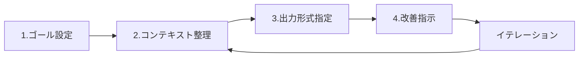

# 高品質な単一HTMLドキュメント作成ガイド - CDN活用とデジタル庁デザインシステム準拠

## はじめに - なぜ今、単一HTMLドキュメントなのか

現代のWeb開発では、複雑なビルドプロセスや依存関係管理が当たり前となっている。しかし、ブリーフィング文書、技術仕様書、オフラインドキュメントなど、特定の用途においては**単一HTMLドキュメント**（セルフコンテインドHTML）が圧倒的な利便性を発揮する。

単一HTMLドキュメントの最大のメリットは、その**配布性と自己完結性**である。サーバー不要、依存関係なし、1ファイルですべてが完結する。メール添付、USBメモリでの配布、イントラネットでの共有など、あらゆる環境で即座に利用可能である[1]。さらに、オフライン環境でも完全に動作し、セキュリティが厳格な環境でも外部通信なしで利用できる。

本記事では、単一HTMLドキュメントを**プロダクションレディ**な品質で作成するための包括的なガイドを提供する。CDN（Content Delivery Network）の最適化、デジタル庁デザインシステムの実装、生成AIを活用した効率的な制作フローまで、実践的な知識とすぐに使えるテンプレートを提供する。

## 単一HTMLドキュメントの基礎設計

### HTML5セマンティック構造の最適化

単一HTMLドキュメントの基盤となるのは、適切に構造化されたHTML5である。すべてのHTML文書は`<!DOCTYPE html>`宣言から始まる必要がある[1]。この宣言により、ブラウザは標準モードでレンダリングを行い、一貫した表示を保証する。

```html
<!DOCTYPE html>
<html lang="ja">
<head>
    <meta charset="UTF-8">
    <meta name="viewport" content="width=device-width, initial-scale=1.0">
    <meta name="description" content="単一HTMLドキュメントのブリーフィング">
    <title>ブリーフィング文書</title>
</head>
<body>
    <header>
        <h1>ドキュメントタイトル</h1>
    </header>
    <main>
        <article>
            <section>
                <h2>セクションタイトル</h2>
                <p>コンテンツ</p>
            </section>
        </article>
    </main>
    <footer>
        <p>&copy; 2025 Organization Name</p>
    </footer>
</body>
</html>
```

セマンティックHTML5要素の適切な使用は、アクセシビリティとSEOの両面で重要である。`<header>`、`<main>`、`<article>`、`<section>`、`<footer>`などの要素は、文書の構造を明確に示す[1]。特に`<main>`要素は1ページに1回のみ使用し、`<body>`の直下に配置することが推奨される。

### インライン化戦略とパフォーマンス最適化

単一HTMLファイルを作成する際の重要な判断は、どのリソースをインライン化するかである。インライン化の基本原則は以下の通りである[2]：

**インライン化判断マトリクス**

| リソース種別 | サイズ閾値 | 推奨手法 | メリット | デメリット |
|------------|-----------|---------|---------|-----------|
| CSS | < 10KB | `<style>`タグ内記述 | 即座にレンダリング | キャッシュ不可 |
| JavaScript | < 5KB | `<script>`タグ内記述 | 外部依存なし | 再利用困難 |
| 画像（アイコン） | < 5KB | Base64エンコード | 単一ファイル化 | ファイルサイズ増加（約33%） |
| SVG | 制限なし | インラインSVG | 編集可能、軽量 | HTMLが冗長化 |
| フォント | < 50KB | Base64/WOFF2 | 確実な表示 | 初期読み込み遅延 |

画像のBase64エンコーディングは、小さなアイコンやロゴに最適である。以下は実装例である：

```html

```

ただし、Base64エンコーディングは元のバイナリサイズの約133%になるため、大きな画像には不適切である[2]。ラインアートやアイコンの場合は、SVGのインライン化が推奨される：

```html
<svg width="24" height="24" viewBox="0 0 24 24" fill="none" 
     xmlns="http://www.w3.org/2000/svg">
    <path d="M12 2L2 7v10c0 5.55 3.84 10.74 9 12 5.16-1.26 9-6.45 9-12V7l-10-5z" 
          fill="currentColor"/>
</svg>
```

## CDN活用による外部リソース管理

### 主要CDNサービスの比較分析

単一HTMLドキュメントであっても、フレームワークやライブラリはCDN経由で読み込むことで、ファイルサイズと保守性のバランスを取ることができる。主要CDNサービスの性能比較は以下の通りである[4]：

**CDNサービス性能比較表**

| サービス | TTFB | 稼働率 | 特徴 | 推奨用途 |
|---------|------|--------|------|---------|
| jsDelivr | <50ms | 99.99% | マルチCDN戦略、中国対応 | プロダクション環境 |
| unpkg | 50-100ms | 99.9% | npm直接配信 | 開発・テスト環境 |
| cdnjs | <60ms | 99.95% | Cloudflare基盤 | 汎用ライブラリ |
| jsdelivr (Fastly) | <40ms | 99.99% | エンタープライズ向け | 大規模サービス |

jsDelivrは、Fastly、Cloudflare、Quantilなど複数のCDNプロバイダーを使用するマルチCDN戦略により、極めて高い可用性を実現している[4]。特に中国を含むアジア地域でのパフォーマンスが優れているため、グローバル展開を考慮する場合は第一選択となる。

### セキュリティとパフォーマンスの実装

CDN経由でリソースを読み込む際は、**SRI（Subresource Integrity）**の実装が必須である。SRIは、CDNから配信されるファイルが改ざんされていないことを保証する[4]：

```html
<!-- Bootstrap 5 with SRI -->
<link href="https://cdn.jsdelivr.net/npm/bootstrap@5.0.2/dist/css/bootstrap.min.css" 
      rel="stylesheet" 
      integrity="sha384-EVSTQN3/azprG1Anm3QDgpJLIm9Nao0Yz1ztcQTwFspd3yD65VohhpuuCOmLASjC" 
      crossorigin="anonymous">

<!-- Tailwind CSS v4 (Play CDN) -->
<script src="https://cdn.jsdelivr.net/npm/@tailwindcss/browser@4"
        integrity="sha384-[actual-hash-here]"
        crossorigin="anonymous"></script>
```

パフォーマンス最適化のための実装パターン：

```html
<head>
    <!-- DNS プリフェッチとプリコネクト -->
    <link rel="dns-prefetch" href="//cdn.jsdelivr.net">
    <link rel="preconnect" href="https://cdn.jsdelivr.net">
    
    <!-- CSSのプリロード -->
    <link rel="preload" 
          href="https://cdn.jsdelivr.net/npm/bootstrap@5.0.2/dist/css/bootstrap.min.css" 
          as="style" 
          onload="this.onload=null;this.rel='stylesheet'">
    
    <!-- フォールバック用のnoscript -->
    <noscript>
        <link rel="stylesheet" 
              href="https://cdn.jsdelivr.net/npm/bootstrap@5.0.2/dist/css/bootstrap.min.css">
    </noscript>
</head>
```

バージョン固定は、長期的なキャッシュ効率と安定性のために重要である。正確なバージョン指定（例：`@5.0.2`）により、CDNは1年間のmax-ageを設定する。一方、範囲指定（例：`@5`）では7日間となる[4]。

## デジタル庁デザインシステムの実装

### デザインシステムβ版の概要と特徴

デジタル庁デザインシステム（β版 v2.6.0）は、日本の行政サービスにおけるデジタル体験の統一と品質向上を目的として開発された**プラットフォーム型デザインシステム**である[3]。公式サイト（design.digital.go.jp）で提供されている。

このシステムの特徴は、特定のブランドやサービスに依存しない高い汎用性にある。政府機関、地方自治体、公的機関のウェブサイトやWebアプリケーションで広く利用可能である[3]。

**デジタル庁デザインシステムの主要コンポーネント**：

1. **基礎デザイン要素**
   - カラーシステム（プライマリ、セカンダリ、セマンティックカラー）
   - タイポグラフィ（和文・欧文フォントの組み合わせ）
   - スペーシングシステム（8pxグリッド基準）

2. **UIコンポーネント**
   - ボタン、フォーム要素
   - ナビゲーション
   - カード、モーダル
   - テーブル、リスト

3. **アクセシビリティ基準**
   - JIS X 8341-3:2016準拠
   - WCAG 2.1/2.2レベルAA達成
   - スクリーンリーダー対応

### 実装テンプレートの構築

デジタル庁デザインシステムに準拠した単一HTMLテンプレートの実装例：

```html
<!DOCTYPE html>
<html lang="ja">
<head>
    <meta charset="UTF-8">
    <meta name="viewport" content="width=device-width, initial-scale=1.0">
    <title>デジタル庁準拠ブリーフィング文書</title>
    
    <style>
        /* デジタル庁カラーシステム */
        :root {
            --color-primary: #1976D2;
            --color-primary-dark: #0D47A1;
            --color-secondary: #424242;
            --color-background: #FFFFFF;
            --color-surface: #F5F5F5;
            --color-error: #D32F2F;
            --color-warning: #F57C00;
            --color-success: #388E3C;
            --spacing-unit: 8px;
        }
        
        /* タイポグラフィ設定 */
        body {
            font-family: "Noto Sans JP", "Hiragino Kaku Gothic ProN", 
                         "メイリオ", sans-serif;
            font-size: 16px;
            line-height: 1.75;
            color: var(--color-secondary);
            background-color: var(--color-background);
            margin: 0;
            padding: 0;
        }
        
        /* レスポンシブコンテナ */
        .container {
            max-width: 1200px;
            margin: 0 auto;
            padding: calc(var(--spacing-unit) * 3);
        }
        
        /* 見出しスタイル */
        h1 {
            font-size: 2rem;
            font-weight: 700;
            color: var(--color-primary);
            margin-bottom: calc(var(--spacing-unit) * 3);
            border-bottom: 3px solid var(--color-primary);
            padding-bottom: calc(var(--spacing-unit) * 2);
        }
        
        h2 {
            font-size: 1.5rem;
            font-weight: 600;
            color: var(--color-primary-dark);
            margin-top: calc(var(--spacing-unit) * 4);
            margin-bottom: calc(var(--spacing-unit) * 2);
        }
        
        /* アクセシビリティ対応フォーカススタイル */
        a:focus,
        button:focus,
        input:focus,
        textarea:focus,
        select:focus {
            outline: 3px solid var(--color-primary);
            outline-offset: 2px;
        }
        
        /* スキップリンク（アクセシビリティ） */
        .skip-link {
            position: absolute;
            top: -40px;
            left: 0;
            background: var(--color-primary);
            color: white;
            padding: 8px;
            text-decoration: none;
            z-index: 100;
        }
        
        .skip-link:focus {
            top: 0;
        }
        
        /* プリント用CSS */
        @media print {
            body {
                font-size: 12pt;
                line-height: 1.5;
            }
            
            .no-print {
                display: none;
            }
            
            h1, h2, h3 {
                page-break-after: avoid;
            }
            
            table, figure {
                page-break-inside: avoid;
            }
        }
    </style>
</head>
<body>
    <!-- アクセシビリティ: スキップリンク -->
    <a href="#main" class="skip-link">メインコンテンツへスキップ</a>
    
    <div class="container">
        <header role="banner">
            <h1>ブリーフィング文書タイトル</h1>
            <p>作成日: <time datetime="2025-01-20">2025年1月20日</time></p>
        </header>
        
        <main id="main" role="main">
            <article>
                <section aria-labelledby="section1">
                    <h2 id="section1">1. 概要</h2>
                    <p>ここに概要を記述します。</p>
                </section>
                
                <section aria-labelledby="section2">
                    <h2 id="section2">2. 詳細内容</h2>
                    <p>詳細な内容を記述します。</p>
                </section>
            </article>
        </main>
        
        <footer role="contentinfo">
            <p>&copy; 2025 組織名. All rights reserved.</p>
        </footer>
    </div>
</body>
</html>
```

## 生成AIを活用したコンテンツ作成

### プロンプトエンジニアリングの実践

生成AIを活用した効率的なコンテンツ作成には、構造化されたプロンプトエンジニアリングが不可欠である。特にClaude向けには、XMLタグを使用した構造化が推奨される[6]。

**深津式プロンプトシステム**の実装例[5]：

```xml
<prompt>
    <role>
        あなたは技術文書作成の専門家です。
        デジタル庁デザインシステムに準拠したブリーフィング文書を作成します。
    </role>
    
    <context>
        - 対象読者: 技術部門の意思決定者
        - 文書の目的: プロジェクト概要の共有
        - 制約: 単一HTMLファイル、5ページ以内
    </context>
    
    <task>
        以下の情報を基に、構造化されたブリーフィング文書を作成してください：
        <input>
            プロジェクト名: デジタル変革推進プロジェクト
            期間: 2025年1月〜12月
            予算: 5000万円
            主要成果物: Webアプリケーション、API、ドキュメント
        </input>
    </task>
    
    <output_format>
        HTML形式で、以下の構造に従って出力してください：
        1. エグゼクティブサマリー（200字）
        2. プロジェクト概要
        3. スケジュール
        4. リスクと対策
        5. 次のアクション
    </output_format>
</prompt>
```

**Chain of Thought（CoT）推論**を活用した段階的な文書生成[6]：

```xml
<thinking>
    まず文書の構造を整理します：
    1. 読者のニーズを特定
    2. 重要な情報の優先順位付け
    3. 論理的な流れの構築
    4. ビジュアル要素の配置決定
</thinking>

<document_generation>
    <!-- 実際の文書生成プロセス -->
</document_generation>
```

### 自動化ワークフローの構築

生成AIを活用した文書作成の自動化ワークフローは、以下の4ステップで構成される[5]：

**プロンプトエンジニアリング4ステップフロー**



1. **ゴール設定**: 明確な目標と成功基準の定義
2. **コンテキスト整理**: 背景情報と制約条件の整理
3. **出力形式指定**: 具体的なフォーマットとスタイルの指定
4. **改善指示**: フィードバックに基づく調整

構造化プロンプトを使用することで、技術タスクの精度が最大40%向上するという研究結果がある[6]。

## 実装例：プロダクションレディなテンプレート

### 完全動作するサンプルコード

以下は、すべての要素を統合したプロダクションレディなブリーフィング文書テンプレートである：

```html
<!DOCTYPE html>
<html lang="ja">
<head>
    <meta charset="UTF-8">
    <meta name="viewport" content="width=device-width, initial-scale=1.0">
    <meta name="description" content="プロジェクトブリーフィング文書">
    <meta name="author" content="組織名">
    <title>プロジェクトブリーフィング | 2025年1月</title>
    
    <!-- CDN: Bootstrap 5 -->
    <link href="https://cdn.jsdelivr.net/npm/bootstrap@5.0.2/dist/css/bootstrap.min.css" 
          rel="stylesheet" 
          integrity="sha384-EVSTQN3/azprG1Anm3QDgpJLIm9Nao0Yz1ztcQTwFspd3yD65VohhpuuCOmLASjC" 
          crossorigin="anonymous">
    
    <style>
        /* カスタムCSS - デジタル庁準拠 */
        :root {
            --primary-color: #1976D2;
            --secondary-color: #424242;
            --success-color: #388E3C;
            --warning-color: #F57C00;
            --danger-color: #D32F2F;
            --light-bg: #F8F9FA;
            --font-family-base: "Noto Sans JP", "Hiragino Kaku Gothic ProN", sans-serif;
        }
        
        body {
            font-family: var(--font-family-base);
            color: var(--secondary-color);
            line-height: 1.75;
        }
        
        .briefing-header {
            background: linear-gradient(135deg, var(--primary-color), #1565C0);
            color: white;
            padding: 3rem 0;
            margin-bottom: 2rem;
        }
        
        .briefing-header h1 {
            font-size: 2.5rem;
            font-weight: 700;
            margin-bottom: 0.5rem;
        }
        
        .section-card {
            background: white;
            border-radius: 8px;
            box-shadow: 0 2px 4px rgba(0,0,0,0.1);
            padding: 2rem;
            margin-bottom: 2rem;
            transition: transform 0.3s ease;
        }
        
        .section-card:hover {
            transform: translateY(-2px);
            box-shadow: 0 4px 8px rgba(0,0,0,0.15);
        }
        
        .metric-box {
            background: var(--light-bg);
            border-left: 4px solid var(--primary-color);
            padding: 1rem;
            margin: 1rem 0;
        }
        
        .metric-value {
            font-size: 2rem;
            font-weight: 700;
            color: var(--primary-color);
        }
        
        .timeline-item {
            position: relative;
            padding-left: 2rem;
            margin-bottom: 1.5rem;
        }
        
        .timeline-item::before {
            content: '';
            position: absolute;
            left: 0;
            top: 0.5rem;
            width: 12px;
            height: 12px;
            border-radius: 50%;
            background: var(--primary-color);
        }
        
        .timeline-item::after {
            content: '';
            position: absolute;
            left: 5px;
            top: 1.5rem;
            width: 2px;
            height: calc(100% + 0.5rem);
            background: #E0E0E0;
        }
        
        .timeline-item:last-child::after {
            display: none;
        }
        
        /* 印刷用スタイル */
        @media print {
            .briefing-header {
                background: none !important;
                color: black !important;
                border-bottom: 3px solid var(--primary-color);
            }
            
            .section-card {
                box-shadow: none;
                border: 1px solid #ddd;
                page-break-inside: avoid;
            }
            
            .no-print {
                display: none !important;
            }
        }
        
        /* アクセシビリティ */
        .sr-only {
            position: absolute;
            width: 1px;
            height: 1px;
            padding: 0;
            margin: -1px;
            overflow: hidden;
            clip: rect(0,0,0,0);
            white-space: nowrap;
            border: 0;
        }
        
        /* レスポンシブテーブル */
        .table-responsive-stack tr {
            display: block;
            border: 1px solid #ccc;
            margin-bottom: 10px;
        }
        
        .table-responsive-stack td {
            display: block;
            text-align: right;
            padding-left: 50%;
            position: relative;
        }
        
        .table-responsive-stack td:before {
            content: attr(data-label);
            position: absolute;
            left: 6px;
            width: 45%;
            text-align: left;
            font-weight: bold;
        }
        
        @media (min-width: 768px) {
            .table-responsive-stack tr {
                display: table-row;
                border: none;
            }
            
            .table-responsive-stack td {
                display: table-cell;
                text-align: left;
                padding-left: 0.75rem;
            }
            
            .table-responsive-stack td:before {
                display: none;
            }
        }
    </style>
    
    <!-- インラインJavaScript -->
    <script>
        // ダークモード切り替え（オプション）
        function toggleDarkMode() {
            document.body.classList.toggle('dark-mode');
            localStorage.setItem('darkMode', 
                document.body.classList.contains('dark-mode'));
        }
        
        // ページ読み込み時の処理
        document.addEventListener('DOMContentLoaded', function() {
            // ダークモード設定の復元
            if (localStorage.getItem('darkMode') === 'true') {
                document.body.classList.add('dark-mode');
            }
            
            // スムーススクロール
            document.querySelectorAll('a[href^="#"]').forEach(anchor => {
                anchor.addEventListener('click', function (e) {
                    e.preventDefault();
                    const target = document.querySelector(this.getAttribute('href'));
                    if (target) {
                        target.scrollIntoView({
                            behavior: 'smooth',
                            block: 'start'
                        });
                    }
                });
            });
            
            // 印刷時の処理
            window.addEventListener('beforeprint', function() {
                document.querySelectorAll('.section-card').forEach(card => {
                    card.style.pageBreakInside = 'avoid';
                });
            });
        });
        
        // プログレスインジケーター
        function updateProgress() {
            const winScroll = document.body.scrollTop || 
                             document.documentElement.scrollTop;
            const height = document.documentElement.scrollHeight - 
                          document.documentElement.clientHeight;
            const scrolled = (winScroll / height) * 100;
            
            const progressBar = document.getElementById('progressBar');
            if (progressBar) {
                progressBar.style.width = scrolled + '%';
            }
        }
        
        window.addEventListener('scroll', updateProgress);
    </script>
</head>
<body>
    <!-- プログレスバー -->
    <div class="progress no-print" style="height: 3px; position: fixed; top: 0; left: 0; right: 0; z-index: 9999;">
        <div id="progressBar" class="progress-bar" role="progressbar" style="width: 0%"></div>
    </div>
    
    <!-- スキップナビゲーション（アクセシビリティ） -->
    <a href="#main-content" class="sr-only sr-only-focusable">メインコンテンツへスキップ</a>
    
    <!-- ヘッダー -->
    <header class="briefing-header">
        <div class="container">
            <h1>デジタル変革推進プロジェクト</h1>
            <p class="lead mb-0">2025年1月 ブリーフィング文書</p>
            <p class="mt-2">
                <span class="badge bg-success">進行中</span>
                <span class="badge bg-light text-dark">フェーズ 2/5</span>
            </p>
        </div>
    </header>
    
    <!-- メインコンテンツ -->
    <main id="main-content" class="container">
        
        <!-- エグゼクティブサマリー -->
        <section class="section-card" aria-labelledby="summary-heading">
            <h2 id="summary-heading" class="h3 mb-4">
                <svg width="24" height="24" class="me-2" style="vertical-align: -4px;">
                    <circle cx="12" cy="12" r="10" fill="var(--primary-color)" opacity="0.2"/>
                    <path d="M12 6v6l4 2" stroke="var(--primary-color)" stroke-width="2" fill="none"/>
                </svg>
                エグゼクティブサマリー
            </h2>
            <p class="lead">
                本プロジェクトは、組織全体のデジタル変革を推進し、業務効率を40%向上させることを目的としています。
                2025年12月までに、主要3システムの統合と、新たなデジタルプラットフォームの構築を完了予定です。
                現在、全体の35%が完了し、計画通り進行中です。
            </p>
        </section>
        
        <!-- キーメトリクス -->
        <section class="section-card" aria-labelledby="metrics-heading">
            <h2 id="metrics-heading" class="h3 mb-4">主要指標</h2>
            <div class="row">
                <div class="col-md-3 col-sm-6">
                    <div class="metric-box">
                        <div class="metric-value">35%</div>
                        <div class="text-muted">進捗率</div>
                    </div>
                </div>
                <div class="col-md-3 col-sm-6">
                    <div class="metric-box">
                        <div class="metric-value">¥25M</div>
                        <div class="text-muted">使用予算</div>
                    </div>
                </div>
                <div class="col-md-3 col-sm-6">
                    <div class="metric-box">
                        <div class="metric-value">45名</div>
                        <div class="text-muted">チーム規模</div>
                    </div>
                </div>
                <div class="col-md-3 col-sm-6">
                    <div class="metric-box">
                        <div class="metric-value">3/8</div>
                        <div class="text-muted">完了マイルストーン</div>
                    </div>
                </div>
            </div>
        </section>
        
        <!-- タイムライン -->
        <section class="section-card" aria-labelledby="timeline-heading">
            <h2 id="timeline-heading" class="h3 mb-4">プロジェクトタイムライン</h2>
            <div class="timeline">
                <div class="timeline-item">
                    <h3 class="h5">フェーズ1: 要件定義</h3>
                    <p class="text-muted mb-1">2025年1月 - 2月</p>
                    <p>ステークホルダーインタビューと現状分析を完了</p>
                </div>
                <div class="timeline-item">
                    <h3 class="h5">フェーズ2: 設計</h3>
                    <p class="text-muted mb-1">2025年3月 - 4月</p>
                    <p>システムアーキテクチャとインターフェース設計</p>
                    <span class="badge bg-primary">現在</span>
                </div>
                <div class="timeline-item">
                    <h3 class="h5">フェーズ3: 開発</h3>
                    <p class="text-muted mb-1">2025年5月 - 8月</p>
                    <p>コア機能の実装とテスト</p>
                </div>
                <div class="timeline-item">
                    <h3 class="h5">フェーズ4: 展開</h3>
                    <p class="text-muted mb-1">2025年9月 - 10月</p>
                    <p>段階的ロールアウトと移行</p>
                </div>
                <div class="timeline-item">
                    <h3 class="h5">フェーズ5: 最適化</h3>
                    <p class="text-muted mb-1">2025年11月 - 12月</p>
                    <p>パフォーマンス調整と文書化</p>
                </div>
            </div>
        </section>
        
        <!-- リスクと対策 -->
        <section class="section-card" aria-labelledby="risks-heading">
            <h2 id="risks-heading" class="h3 mb-4">リスクと対策</h2>
            <div class="table-responsive">
                <table class="table table-hover">
                    <thead>
                        <tr>
                            <th scope="col">リスク項目</th>
                            <th scope="col">影響度</th>
                            <th scope="col">発生確率</th>
                            <th scope="col">対策</th>
                        </tr>
                    </thead>
                    <tbody>
                        <tr>
                            <td data-label="リスク項目">技術的複雑性</td>
                            <td data-label="影響度">
                                <span class="badge bg-danger">高</span>
                            </td>
                            <td data-label="発生確率">
                                <span class="badge bg-warning">中</span>
                            </td>
                            <td data-label="対策">専門家レビューと段階的実装</td>
                        </tr>
                        <tr>
                            <td data-label="リスク項目">予算超過</td>
                            <td data-label="影響度">
                                <span class="badge bg-warning">中</span>
                            </td>
                            <td data-label="発生確率">
                                <span class="badge bg-success">低</span>
                            </td>
                            <td data-label="対策">月次予算レビューと早期警告システム</td>
                        </tr>
                        <tr>
                            <td data-label="リスク項目">人材不足</td>
                            <td data-label="影響度">
                                <span class="badge bg-warning">中</span>
                            </td>
                            <td data-label="発生確率">
                                <span class="badge bg-warning">中</span>
                            </td>
                            <td data-label="対策">外部リソース確保と知識移転計画</td>
                        </tr>
                    </tbody>
                </table>
            </div>
        </section>
        
        <!-- 次のアクション -->
        <section class="section-card" aria-labelledby="actions-heading">
            <h2 id="actions-heading" class="h3 mb-4">次のアクション</h2>
            <div class="list-group">
                <div class="list-group-item">
                    <div class="d-flex w-100 justify-content-between">
                        <h3 class="h5 mb-1">設計レビュー会議</h3>
                        <small class="text-muted">期限: 2025年2月15日</small>
                    </div>
                    <p class="mb-1">全ステークホルダーによるシステム設計の最終レビュー</p>
                    <small>担当: 技術リード</small>
                </div>
                <div class="list-group-item">
                    <div class="d-flex w-100 justify-content-between">
                        <h3 class="h5 mb-1">開発環境構築</h3>
                        <small class="text-muted">期限: 2025年2月28日</small>
                    </div>
                    <p class="mb-1">CI/CDパイプラインとテスト環境のセットアップ</p>
                    <small>担当: DevOpsチーム</small>
                </div>
                <div class="list-group-item">
                    <div class="d-flex w-100 justify-content-between">
                        <h3 class="h5 mb-1">第1四半期レポート作成</h3>
                        <small class="text-muted">期限: 2025年3月31日</small>
                    </div>
                    <p class="mb-1">進捗状況と予算執行状況の報告書作成</p>
                    <small>担当: プロジェクトマネージャー</small>
                </div>
            </div>
        </section>
        
    </main>
    
    <!-- フッター -->
    <footer class="container-fluid bg-light py-4 mt-5">
        <div class="container">
            <div class="row">
                <div class="col-md-6">
                    <p class="text-muted mb-0">
                        &copy; 2025 組織名. All rights reserved.
                    </p>
                </div>
                <div class="col-md-6 text-md-end">
                    <p class="text-muted mb-0">
                        最終更新: <time datetime="2025-01-20">2025年1月20日</time>
                    </p>
                </div>
            </div>
        </div>
    </footer>
    
    <!-- Bootstrap JS（オプション） -->
    <script src="https://cdn.jsdelivr.net/npm/bootstrap@5.0.2/dist/js/bootstrap.bundle.min.js" 
            integrity="sha384-MrcW6ZMFYlzcLA8Nl+NtUVF0sA7MsXsP1UyJoMp4YLEuNSfAP+JcXn/tWtIaxVXM" 
            crossorigin="anonymous"></script>
</body>
</html>
```

### カスタマイズと拡張

上記テンプレートは、以下の方法でカスタマイズ可能である：

**1. 組織ブランディングの適用**

```css
/* ブランドカラーの変更 */
:root {
    --primary-color: #貴社のブランドカラー;
    --secondary-color: #貴社のセカンダリカラー;
}

/* ロゴの追加 */
.company-logo {
    background-image: url('data:image/svg+xml;base64,[Base64エンコードされたロゴ]');
    width: 150px;
    height: 50px;
}
```

**2. 多言語対応**

```html
<!-- 言語切り替えボタン -->
<div class="language-selector">
    <button onclick="switchLanguage('ja')">日本語</button>
    <button onclick="switchLanguage('en')">English</button>
</div>

<script>
function switchLanguage(lang) {
    document.documentElement.lang = lang;
    // 言語別のコンテンツを表示/非表示
    document.querySelectorAll('[data-lang]').forEach(el => {
        el.style.display = el.dataset.lang === lang ? 'block' : 'none';
    });
}
</script>
```

**3. チャート・グラフの追加（Chart.js使用）**

```html
<!-- CDN経由でChart.js読み込み -->
<script src="https://cdn.jsdelivr.net/npm/chart.js@3.9.1/dist/chart.min.js"></script>

<canvas id="progressChart" width="400" height="200"></canvas>

<script>
const ctx = document.getElementById('progressChart').getContext('2d');
new Chart(ctx, {
    type: 'line',
    data: {
        labels: ['1月', '2月', '3月', '4月', '5月'],
        datasets: [{
            label: '進捗率',
            data: [10, 25, 35, 45, 60],
            borderColor: 'var(--primary-color)',
            tension: 0.1
        }]
    },
    options: {
        responsive: true,
        maintainAspectRatio: false
    }
});
</script>
```

## まとめと今後の展望

本記事では、高品質な単一HTMLドキュメントを作成するための包括的なアプローチを解説した。CDNの最適化、デジタル庁デザインシステムの実装、生成AIの活用により、プロダクションレディな文書を効率的に作成できる。

**ベストプラクティスチェックリスト**：

- [ ] HTML5セマンティック構造の適用
- [ ] 適切なインライン化戦略の実施
- [ ] CDN利用時のSRI実装
- [ ] アクセシビリティ基準（WCAG 2.2）の準拠
- [ ] レスポンシブデザインの実装
- [ ] プリント最適化CSSの追加
- [ ] 生成AI用構造化プロンプトの活用

技術の進化により、**Web Components**や**CSS Container Queries**など、より高度な機能が単一HTMLドキュメントでも利用可能になりつつある。将来的には、WebAssemblyの活用により、さらに高性能なインタラクティブ文書の作成が期待される。

継続的な改善のためには、ユーザーフィードバックの収集と、定期的なテンプレートの更新が重要である。本記事で提供したテンプレートとガイドラインを基に、組織のニーズに合わせた最適化を進めていただきたい。

---

## 参考文献

[1] MDN Web Docs - Document and website structure  
[2] Stack Overflow - Inline CSS/Javascript into a HTML file  
[3] デジタル庁デザインシステムβ版  
[4] jsDelivr vs unpkg vs cdnjs: Best Free CDN  
[5] 生成AIのプロンプトガイド｜テンプレート18選  
[6] Claude 4 prompt engineering best practices  
[7] Content Brief Templates: 19 Free Downloads  
[8] KeyCDN - Inline Small CSS and JavaScript